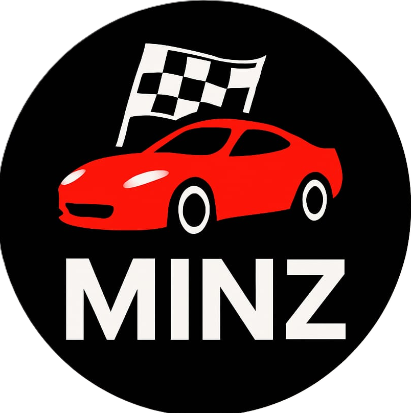

# 🏎️ Minz Racing - Ultimate Mobile Racing Game

> A high-performance 3D mobile racing game built with Three.js, optimized for Android and iOS devices.



## 📱 Features

### 🎮 **Gameplay**
- **3D Racing Experience** — Built with Three.js for stunning 3D graphics
- **Dynamic Obstacles** — Avoid colorful obstacles and navigate the road
- **Nitro Boost System** — Activate turbo for speed bursts with haptic feedback
- **Combo Multiplier** — Chain consecutive obstacle dodges for score multipliers
- **Progressive Difficulty** — Each level increases speed and challenge
- **Score & Coins System** — Earn coins and XP, compete for high scores

### 📊 **Game Mechanics**
- **Gear System** — Auto-shifting gears (N, 1-5) based on speed
- **Speedometer** — Real-time speed display in KM/H
- **Progress Bar** — Level completion tracker
- **Collision Detection** — Physics-based crash system with crash sound
- **Level System** — 5+ levels with escalating difficulty

### 📱 **Mobile Optimization**
- ✅ **Full Android Support** (8.0+) — Touch controls, vibration feedback
- ✅ **Full iOS Support** (13.0+) — Safe-area insets, gesture audio handling
- ✅ **Auto-rotating Controls** — Adapts to device orientation
- ✅ **High-DPI Support** — Pixel-perfect rendering on retina/2x/3x displays
- ✅ **Notch/Safe Area Support** — Works with notched devices (iPhone X+, etc.)
- ✅ **Virtual Keyboard** — Auto-focus on name input field
- ✅ **Haptic Feedback** — Vibration on collisions, nitro, and interactions
- ✅ **Progressive Web App (PWA)** — Install as app on home screen

### 🎨 **Visual Features**
- **Realistic Car Model** — 3D red racing car with wheels and headlights
- **Dynamic Buildings** — Parallax cityscape with lit windows
- **Road Markings** — Yellow center lines, red/white edge markers
- **Spark Effects** — Visual feedback when scraping road edges
- **Smooth Animations** — 60 FPS gameplay on modern devices

### 🔊 **Audio**
- **Background Music (BGM)** — Looped racing soundtrack
- **Crash Sound Effects** — Impact audio on collisions
- **Smart Audio Handling** — iOS gesture-based autoplay support

---

## 🚀 Quick Start

### Play Online
Simply open the game in your browser:
```
https://your-deployment-url/index.html
```

### Install as PWA (Mobile)
1. Open the game URL in your mobile browser
2. Tap **Menu** → **"Add to Home Screen"** (Android) or **Share** → **"Add to Home Screen"** (iOS)
3. The game installs with full-screen, icon, and offline support

### Local Testing
```bash
# Navigate to project directory
cd Minzv2

# Start a local HTTP server (Python 3)
python -m http.server 8000

# Open in browser
# Desktop: http://localhost:8000
# Mobile: http://[Your-PC-IP]:8000
```

---

## 🎮 How to Play

### 🏁 **Starting the Game**
1. Enter your racer name (virtual keyboard auto-opens)
2. Click **"START ENGINE"** to begin
3. Device rotates to landscape mode (required for gameplay)

### 🕹️ **Controls**
- **Circular Control Wheel (Bottom)** — Touch-based controls
  - **⬆ (Center)** — Accelerate
  - **⬅ (Left)** — Steer Left (Touch)
  - **➡ (Right)** — Steer Right (Touch)

- **📱 Device Tilt (Gyroscope)** — Tilt phone to steer
  - **Tilt LEFT** → Car moves LEFT
  - **Tilt RIGHT** → Car moves RIGHT
  - Works on Android 8+ and iOS 13+
  - See `GYROSCOPE_GUIDE.md` for troubleshooting

- **🔥 Nitro Button (Top Center)** — Activate turbo boost
  - Requires nitro energy (recharges automatically)
  - Provides 1.6x speed multiplier
  - Vibration feedback on activation

### 🎯 **Objective**
- Dodge colorful obstacles on the road
- Build combos by avoiding consecutive obstacles
- Reach the level target score to complete
- Progress through 5+ increasingly difficult levels
- Beat your high score!

### 💰 **Rewards**
- **Coins** — 50 + (Level × 50) per level completion
- **XP** — 30 + (Level × 20) per level
- **High Score** — New record achievement

---

## 📁 Project Structure

```
Minzv2/
├── index.html              # Main game file (entire app in one file)
├── manifest.json           # PWA manifest for mobile installation
├── README.md               # This file
├── assets/
│   ├── logo.png           # Game logo & PWA icons
│   ├── bgm.mp3            # Background music
│   └── crash.mp3          # Collision sound effect
└── .github/
    └── workflows/         # (Optional) CI/CD pipeline
```

---

## 🛠️ Technical Stack

| Technology | Purpose |
|-----------|---------|
| **HTML5** | Semantic markup, PWA structure |
| **CSS3** | Styling, animations, safe-area support |
| **JavaScript (Vanilla)** | Game logic, controls, physics |
| **Three.js** | 3D graphics rendering |
| **localStorage** | Player data persistence |
| **Vibration API** | Haptic feedback |
| **Intersection Observer** | Performance optimization |

---

## 📱 Browser Compatibility

| Browser | Mobile | Desktop | Status |
|---------|--------|---------|--------|
| **Chrome/Edge** | ✅ Android 8+ | ✅ Latest | Full Support |
| **Safari** | ✅ iOS 13+ | ✅ Latest | Full Support |
| **Firefox** | ✅ Android 8+ | ✅ Latest | Full Support |
| **Samsung Internet** | ✅ Latest | — | Full Support |

---

## ⚙️ Mobile Optimizations

### Viewport Configuration
```html
viewport-fit=cover              <!-- Supports notched devices -->
maximum-scale=5.0               <!-- Allows user pinch-zoom for accessibility -->
user-scalable=yes               <!-- Better accessibility support -->
```

### Safe Area Support
- Automatically adapts HUD position for notches (iPhone X+, etc.)
- Respects rounded corners on modern devices

### Audio Handling
- Gesture-based autoplay for iOS (plays after user interaction)
- Android auto-plays background music immediately
- Graceful fallback for browsers with audio restrictions

### Performance
- 60 FPS target on modern mobile devices
- Pixel ratio scaling for crisp graphics
- Optimized Three.js renderer settings
- Efficient garbage collection for long gameplay sessions

### Input Support
- Touch events (primary)
- Mouse events (fallback for testing)
- Device orientation detection
- Haptic vibration feedback

---

## 🔐 Privacy & Data

- **Local Storage Only** — Player data (name, high score, coins) stored locally
- **No Network Calls** — Game is completely offline-capable
- **No Tracking** — No analytics or user tracking

---

## 📊 Game Stats Display

### HUD (Top Left)
- **Player Name** — Your entered racer name
- **Score** — Current level score
- **Coins** — Total coins earned
- **Level** — Current level number

### Speedometer (Bottom Right)
- Real-time speed display (0-250 KM/H)

### Gear Display (Top Right)
- Current gear (N, 1-5)
- Auto-shifts based on speed

### Nitro Bar (Top Center)
- Nitro energy level
- Recharges when not active

### Progress Bar (Center-Left)
- Level completion percentage
- Level target indicator

---

## 🎮 Game Physics

### Speed System
- **Base Max Speed** — 2.5 units
- **Nitro Boost** — 1.6x multiplier
- **Acceleration** — 0.015 units/frame
- **Braking** — 0.08 units/frame deceleration
- **Natural Deceleration** — 0.005 units/frame

### Steering
- **Sensitivity** — 0.3 units/frame turn rate
- **Lane Width** — ±5.5 units (±7 lanes total)
- **Car Rotation** — -0.15 radians per steering input

### Collision Detection
- **Radius** — 3.2 units from car center
- **Damage** — Speed reduced to 40% on hit
- **Combo Reset** — Hit resets combo multiplier

---

## 📈 Progression System

### Level Scaling
| Level | Speed Max | Target Score | Coin Reward | Notes |
|-------|-----------|--------------|-------------|-------|
| 1 | 2.5 | 300 | 100 | Tutorial level |
| 2 | 2.7 | 500 | 150 | Faster pace |
| 3 | 2.9 | 700 | 200 | Challenging |
| 4+ | +0.2 | +200 | +50 | Escalating difficulty |

### Scoring
- **Base Points** — Speed × 10 per frame
- **Combo Multiplier** — (Combo + 1) × Base Points
- **Obstacle Avoidance** — +15 base points per obstacle dodged

---

## 🐛 Troubleshooting

### **Issue: Game won't load on mobile**
- ✅ Check internet connection (for Three.js CDN)
- ✅ Ensure device is in landscape mode
- ✅ Try refreshing the page
- ✅ Clear browser cache

### **Issue: Audio not playing (iOS)**
- ✅ Make sure you tapped the login button (triggers audio autoplay)
- ✅ Check device volume is not muted
- ✅ Allow audio permissions in Safari settings

### **Issue: Controls not responding**
- ✅ Ensure you're touching the circular control wheel
- ✅ Try refreshing the page
- ✅ Check if game has started (after countdown)

### **Issue: Low FPS / Laggy**
- ✅ Close other browser tabs
- ✅ Check device storage (clear cache if low)
- ✅ Reduce background apps
- ✅ Try restarting the device

### **Issue: High score not saving**
- ✅ Check if browser allows localStorage (not in private mode)
- ✅ Clear browser cache and retry
- ✅ Ensure you completed a full race

---

## 🤝 Contributing

Contributions are welcome! Feel free to:
- Report bugs via [GitHub Issues](https://github.com/Someshwar-prox/Minzv2/issues)
- Submit pull requests for improvements
- Suggest new features

### Development Tips
1. Test on actual mobile devices when possible
2. Use Chrome DevTools mobile emulation for quick testing
3. Test both touch and mouse inputs
4. Check for console errors in DevTools

---

## 📄 License

This project is licensed under the MIT License — feel free to use, modify, and distribute!

---

## 🙏 Credits

- **Three.js** — 3D graphics library
- **Bootstrap CDN** — Audio hosting
- **Your Awesome Creativity** — Game design & mechanics

---

## 📞 Support & Feedback

Have questions or suggestions? Reach out:
- **GitHub Issues** — [Report bugs or request features](https://github.com/Someshwar-prox/Minzv2/issues)
- **GitHub Discussions** — [Join the community](https://github.com/Someshwar-prox/Minzv2/discussions)

---

## 🎉 Have Fun Racing!

Download, install, and start racing! Compete for the highest score and become the ultimate street racer. 🏁

**Minz Racing** — *Speed. Skill. Victory.* 🚀

---

**Last Updated:** November 12, 2025  
**Version:** 1.0.0  
**Status:** Production Ready ✅
